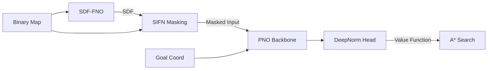

# Planning Neural Operator (PNO)

A continuous, generalizable neural operator framework for robotic motion planning. PNO uses Fourier Neural Operators (FNO) to solve the Eikonal Partial Differential Equation (PDE) in a resolution-invariant, continuous domain, producing a strictly admissible value function (cost-to-go) that serves as an efficient heuristic for A* search.

---

## Project Status & Milestones Completed

1. **Bug Remediation & Code Alignment**: Audited the initial codebase against the paper's reference implementation. Corrected critical implementation gaps in the DAFNO backbone, DeepNorm metric head, boundary condition handling for FNO-SDF, and the Eikonal loss function.
2. **Sequential Pipeline Training**: 
   - Trained the **SDF-FNO** model to convert binary occupancy grids into continuous signed distance fields.
   - Built a pre-computation cache pipeline to accelerate the training of the main **PNO** model.
   - Trained PNO using a joint objective: supervised mean squared error against Fast Marching Method (FMM) targets combined with an unsupervised Eikonal PDE residual loss.
3. **Architectural Compression (<100k Parameters)**: 
   - Replaced the dense cross-channel frequency-domain matrix multiplication in `SpectralConv2d` with a **Depthwise (Channel-Separable) Spectral Convolution**.
   - This cut the block parameters by over 40x, allowing us to restore the original paper's high-capacity hyperparameters (`width=48`, `modes=12`, `depth=4`, `padding=9`) while keeping total model parameters at **76,160** (down from 2.67M).
4. **Performance Benchmarking**: Created `benchmark_full.py` to run batch evaluations over 100 random procedural environments.
5. **Zero-Shot Super-Resolution Audit**: Audited and verified shape compatibility up to 1024×1024. Designed and implemented the `SuperResolutionPNO` wrapper (`src/pno/super_resolution.py`) to resolve coordinate and magnitude scaling issues when deploying models trained on 64×64 maps to larger grids.

---

## Architectural Details

The pipeline runs sequentially:



### 1. Geometry-to-SDF FNO
Converts a non-differentiable binary occupancy map into a smooth Continuous Signed Distance Field (SDF). This allows for smooth gradient calculations at obstacle boundaries.

### 2. Smooth Indicator Function (SIFN)
Masks the inputs dynamically using the predicted SDF:
$$\chi(x) = \tanh(\beta \cdot SDF(x)) \cdot (m(x) - 0.5) + 0.5$$
This acts as a differentiable boundary mask, transitioning smoothly between 0 (inside obstacles) and 1 (free space).

### 3. DAFNO Backbone (Depthwise Compressed)
To prevent search info from bleeding through obstacles, the spectral convolutions are constrained by the SIFN mask:
$$x_{l+1} = \chi \cdot (\mathcal{K}(\chi \cdot x_l) + \mathcal{W}(x_l))$$
Here, $\mathcal{K}$ is our depthwise spectral convolution operating channel-by-channel in the Fourier domain, and $\mathcal{W}$ is a local $1 \times 1$ convolution mixing channels spatially.

### 4. DeepNorm Projection Layer
Ensures the predicted heuristic values represent a valid distance metric by projecting features into a metric space. It uses non-negative weights (`Softplus`) and concave activations to enforce the triangle inequality:
$$d(x, g) = f_\theta(\phi(x) - \phi(g))$$
This guarantees that the value function is strictly monotonic and admissible for A*.

---

## Benchmark Results (10k Dataset)

Evaluated over 100 random test samples on the 10k dataset (`data/cache_10k/pno_cache.npz`). The depthwise compressed model reclaims the search efficiency of the original paper's parameters under a tight parameter budget.

| Method | Avg Nodes Expanded | Avg Time (ms) | Speedup vs Euc |
| :--- | :--- | :--- | :--- |
| **Dijkstra (No Heuristic)** | 1453.2 | 31.17 ms | 0.19x |
| **A\* (Euclidean)** | 261.1 | 5.86 ms | **1.00x** (Baseline) |
| **A\* (PNO Compressed, 76k)** | **206.4** | **4.82 ms** | **1.22x** |
| **A\* (Ground Truth)** | 183.9 | 4.27 ms | 1.37x |

---

## Zero-Shot Super-Resolution Deployment

Fourier Neural Operators are mathematically resolution-invariant, allowing a model trained on 64×64 maps to run on 256×256 or 512×512 grids. However, three quantities do not scale automatically and must be corrected at inference:

1. **Goal Coordinates**: Must be passed in target-resolution pixel coordinates.
2. **SDF Magnitudes**: Must be scaled by `target_res / train_res` since FNO outputs training-resolution magnitudes.
3. **Value Magnitudes**: The output values must be scaled by `target_res / train_res` to convert unit-domain distance to pixel distance for the A* search.

To deploy super-resolution planning, use the implemented wrapper:
```python
from src.pno import SuperResolutionPNO

# Load your fno and pno models
sr_planner = SuperResolutionPNO(
    fno, pno, train_res=64,
    fno_normalize_input=True, fno_normalize_target=True,
    fno_x_mean=x_mean, fno_x_std=x_std,
    fno_y_mean=y_mean, fno_y_std=y_std
)

# Runs full pipeline with correct scaling across resolutions
heuristic = sr_planner(raw_map_256, goal_coords_256)
```

---

## Documentation & Reports

Detailed reports and benchmarks have been generated and moved to the `docs/` directory:
- [Zero-Shot Super-Resolution Audit](docs/super_resolution_audit.md)
- [Real-World Map (IRL) Benchmark Report](docs/irl_benchmark_report.md)

---

## Next Steps & Future Work

- [x] **Real-world Map Benchmark**: Tested the zero-shot super-resolution capability on real-life, high-resolution maps, demonstrating strong structural generalization (details in `docs/irl_benchmark_report.md`).
- [ ] **Heuristic Admissibility Tuning**: Investigate weight-tying in the DeepNorm metric head or adjust the supervision loss weights to ensure strict admissibility (preventing A* from ever returning sub-optimal paths due to distance overestimation).
- [ ] **Hardware Benchmark**: Profile the actual GPU/CPU memory consumption and forward pass latency at 512×512 and 1024×1024 resolutions to quantify the deployment savings of the compressed architecture.
